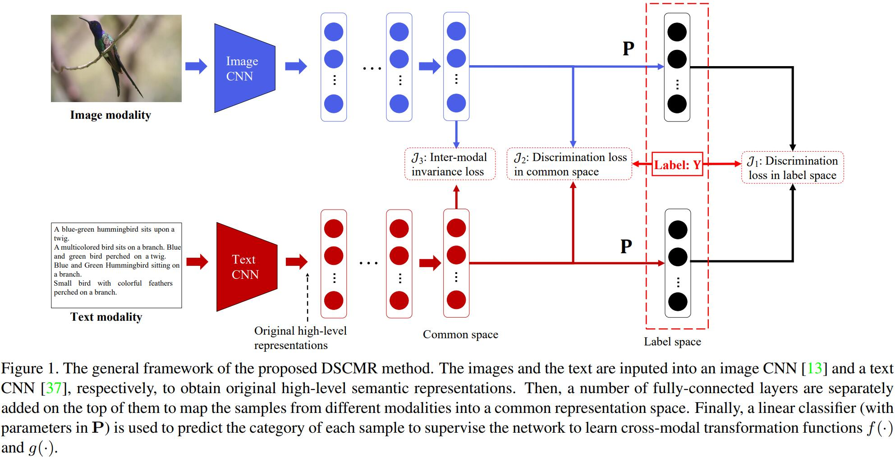
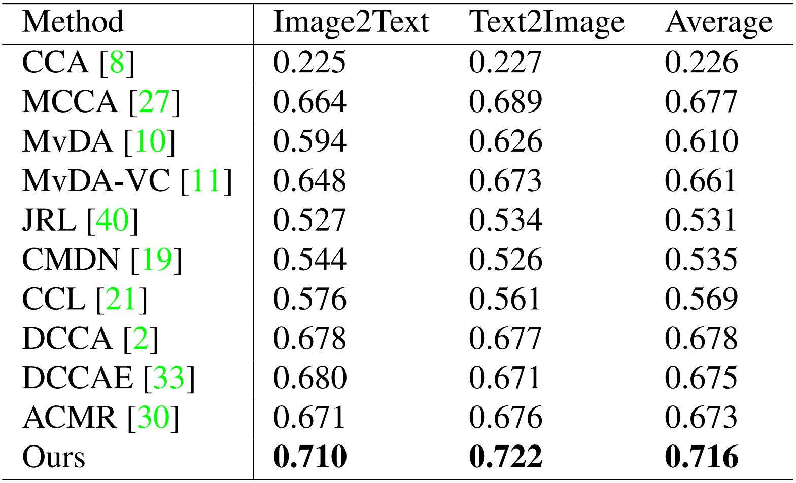

# DSCMR
Liangli Zhen*, Peng Hu*, Xu Wang, Dezhong Peng, [Deep Supervised Cross-modal Retrieval](http://openaccess.thecvf.com/content_CVPR_2019/html/Zhen_Deep_Supervised_Cross-Modal_Retrieval_CVPR_2019_paper.html)[C], IEEE Conference on Computer Vision and Pattern Recognition (CVPR), 2019: 10394-10403. (*denotes equal contribution, PyTorch Code)

## Abstract
  Cross-modal retrieval aims to enable flexible retrieval across different modalities. The core of cross-modal retrieval is how to measure the content similarity between different types of data. In this paper, we present a novel cross-modal retrieval method, called Deep Supervised Cross-modal Retrieval (DSCMR). It aims to find a common representation space, in which the samples from different modalities can be compared directly. Specifically, DSCMR minimises the discrimination loss in both the label space and the common representation space to supervise the model learning discriminative features. Furthermore, it simultaneously minimises the modality invariance loss and uses a weight sharing strategy to eliminate the cross-modal discrepancy of multimedia data in the common representation space to learn modality-invariant features. Comprehensive experimental results on four widely-used benchmark datasets demonstrate that the proposed method is effective in cross-modal learning and significantly outperforms the state-of-the-art cross-modal retrieval methods.
  
## Framework


<!--## Result
-->
## Result
Performance comparison in terms of mAP scores on the Pascal Sentence dataset. The highest score is shown in boldface.


## Citing DSCMR
If you find MAN useful in your research, please consider citing:
```
@inproceedings{zhen2019deep,
  title={Deep Supervised Cross-Modal Retrieval},
  author={Zhen, Liangli and Hu, Peng and Wang, Xu and Peng, Dezhong},
  booktitle={Proceedings of the IEEE Conference on Computer Vision and Pattern Recognition},
  pages={10394--10403},
  year={2019}
}
```
